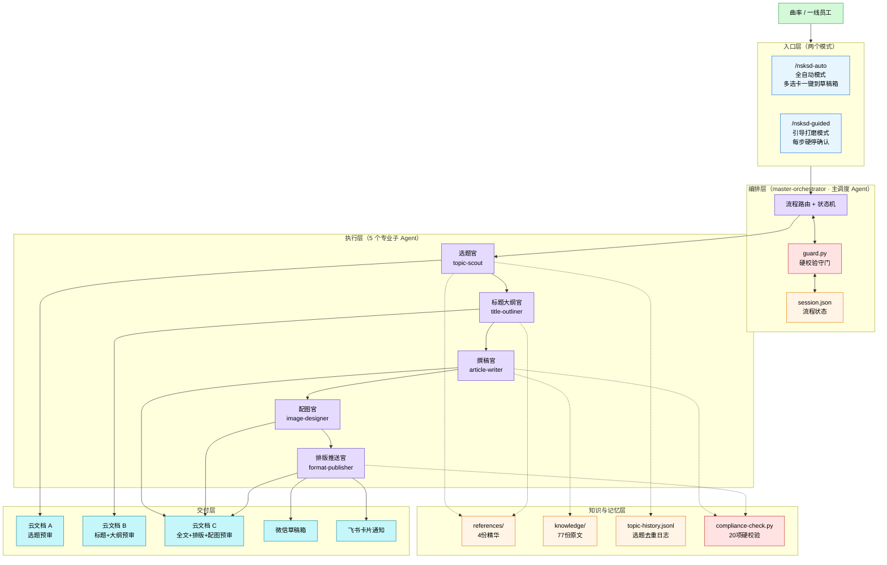

# 图 1 · 日生研内容创作 Skill 整体架构

## 读图说明

- **入口层**：两个斜杠命令对应两种使用风格，用户在起步时选定
- **编排层**：主 Agent 只做调度和状态管理，不碰内容——避免一个 Agent 塞太多上下文
- **执行层**：每个子 Agent 单一职责，独立上下文，互不污染
- **知识与记忆层**：选题去重日志（topic-history）是这一版新增，解决"每天选题都一样"
- **交付层**：3 份云文档对应引导模式的 3 次预审；草稿箱是最终出口
