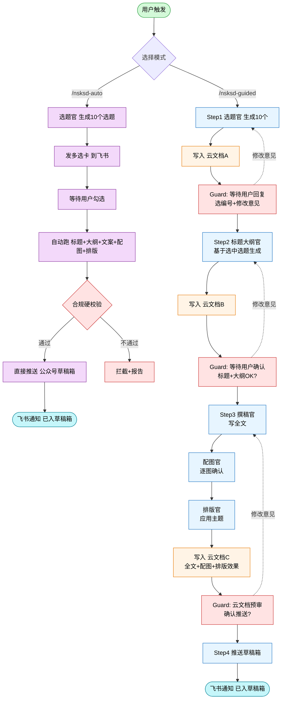

# 图 2 · 双模式对比（自动 vs 引导）

## 两种模式的本质区别

| 维度 | 全自动模式 | 引导打磨模式 |
|------|----------|-------------|
| **适用人群** | 业务/文字能力较弱的一线员工 | 业务/文字能力较强的资深员工 |
| **目标** | 堆量，跑得快 | 打磨，跑得稳 |
| **确认次数** | 1次（只在多选卡勾选） | 3次（选题/标题大纲/全文预审） |
| **云文档** | 0份 | 3份 |
| **每步可修改** | 否 | 是（打回重跑） |
| **合规检查** | 推送前硬校验 | 每步都走 + 推送前硬校验 |
| **失败兜底** | 合规不过直接拦截 | 每步都可人工接管 |

## 硬停机制（Guard）

- 引导模式每一步都调用 `python3 scripts/guard.py check --step N`
- 上一步状态非 `confirmed` 则 `exit 1`，Agent 不得进入下一步
- 用户回复后调用 `guard.py confirm --step N --user-reply "..."` 落盘状态
- 状态文件：`/tmp/nsksd-session-{date}.json`
