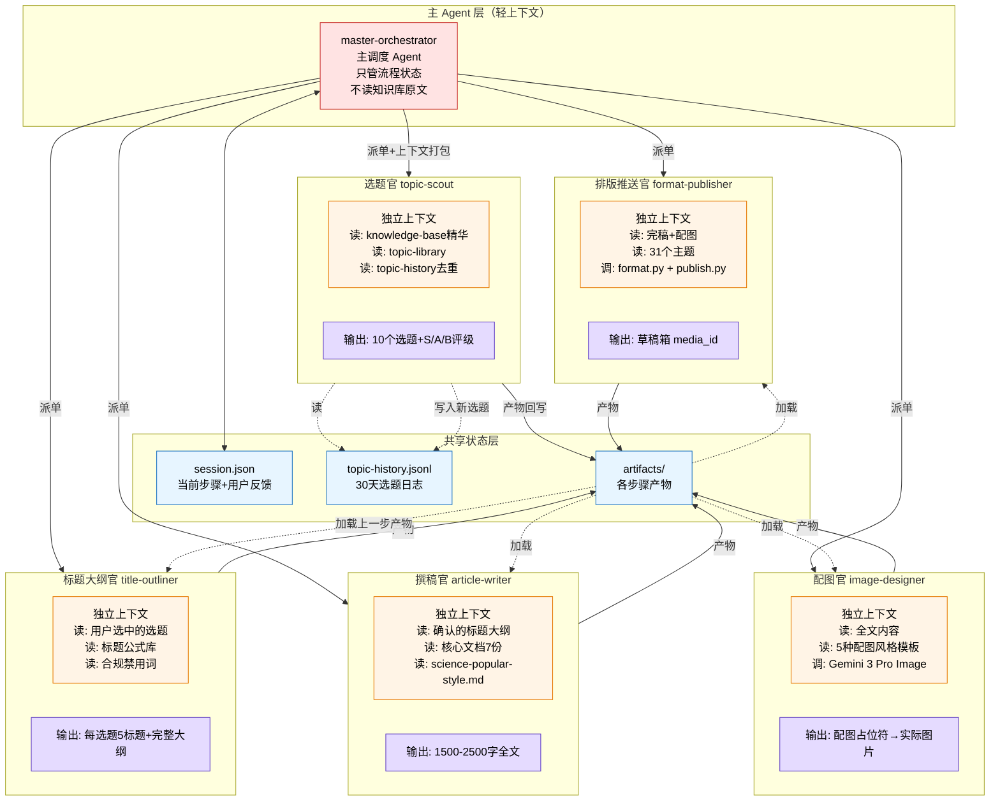

# 图 3 · 多 Agent 协作架构（核心创新）



## 为什么要多 Agent

**单 Agent 问题**：所有知识塞一个上下文 → 37KB SKILL.md + 77份知识库 + 20项合规 + 31个主题——Agent 注意力被稀释，细节必丢。

**多 Agent 解法**：
- 每个 Agent 只读自己岗位需要的文件（上下文瘦身 5-10 倍）
- 主 Agent 只做流程编排，不碰内容
- 产物通过 `artifacts/` 文件系统传递，不走对话上下文

## 每个 Agent 的最小上下文

| Agent | 读什么 | 不读什么 | 输出到 |
|-------|--------|---------|--------|
| topic-scout | knowledge-base.md + topic-library.md + topic-history.jsonl | 77份原文、31个主题、合规清单 | artifacts/step1-topics.json |
| title-outliner | step1选中的选题 + 标题公式库 | 配图、主题、全文 | artifacts/step2-titles.json |
| article-writer | step2产物 + 核心文档7份 + science-popular-style | 选题库、主题、推送配置 | artifacts/step3-article.md |
| image-designer | step3全文 + 配图风格模板 | 合规清单、主题、发布配置 | artifacts/step4-images/ |
| format-publisher | step3全文 + step4配图 + 主题选择 | 选题库、知识库原文 | artifacts/step5-media_id.txt |

## 实现机制

用 Claude Code 的 Task Tool（subagent_type）派发：

```python
# 伪代码
master.dispatch(
    subagent_type="general-purpose",
    role="topic-scout",
    prompt="读取 references/knowledge-base.md + topic-history.jsonl，去重后生成10个选题，输出到 artifacts/step1-topics.json",
    allowed_files=[
        "references/knowledge-base.md",
        "references/topic-library.md",
        "/tmp/nsksd/topic-history.jsonl"
    ]
)
```

子 Agent 跑完归还结果，主 Agent 不继承子 Agent 的长上下文——只拿到产物文件路径。
