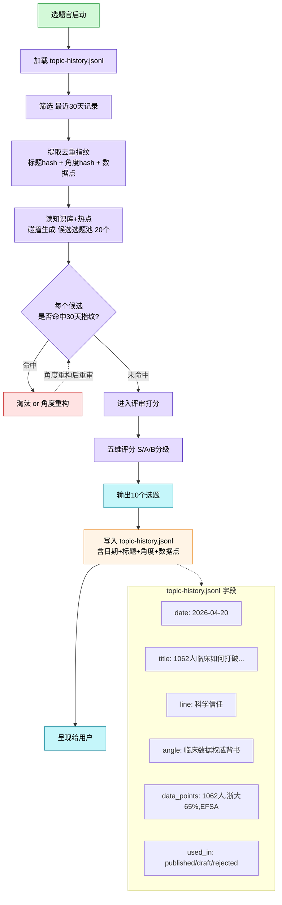

# 图 4 · 选题去重机制（30天窗口）



## 去重机制的 3 层指纹

不只是标题去重，三维指纹匹配：

| 指纹 | 匹配规则 | 示例 |
|------|---------|------|
| **标题语义** | 标题去停用词后 jaccard > 0.6 视为重复 | "1062人临床证明X" vs "1062人试验揭示X" → 命中 |
| **核心角度** | angle 字段严格匹配 | "临床数据权威背书" 30天内只能出现1次 |
| **数据点组合** | data_points 集合重合 ≥ 2 视为重复 | 同时用了"1062人+EFSA"的选题合并计数 |

## 30天滚动窗口

```
Day 1:    选题A (用了1062人数据)
Day 5:    选题B (用了浙大65%+EFSA)
Day 10:   选题C (品牌故事线，无重叠)
...
Day 31:   选题A 的指纹 过期 → 可以重新出现（换角度重写）
```

## 写入时机

| 时机 | used_in 字段 |
|------|------------|
| 选题官输出10个 | `candidate` |
| 用户选中的（进入第二步） | `selected` |
| 最终推送草稿箱 | `published` |
| 用户打回/淘汰 | `rejected` |

**关键**：未被选中的候选选题也入库，防止下次又推一遍。

## 紧急逃生阀

知识库就这么多素材，硬去重30天可能卡死。方案：
- 30天全命中 → 允许**角度重构**复用（同素材不同切入）
- 角度重构 ≥ 3次还命中 → 报警给主 Agent + 管理员："选题池枯竭，需补知识库"

## 文件位置

```
~/.claude/skills/nsksd-content/
  └── logs/
      └── topic-history.jsonl   # 每行一个JSON记录
```
